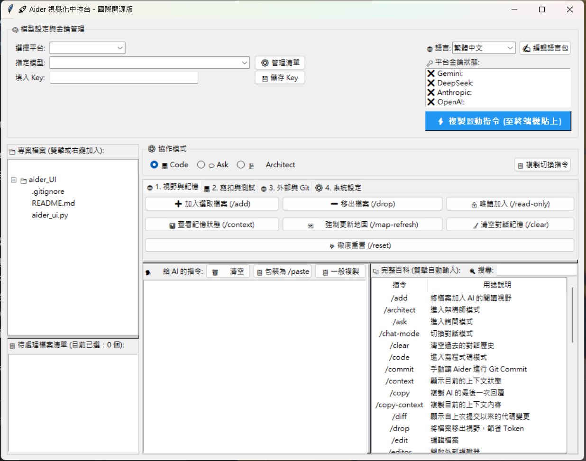

# 🚀 Aider 視覺化中控台 (Aider Visual Console)

這是一個為 [Aider](https://aider.chat/) 打造的輕量級、跨平台、具備多國語言支援的視覺化圖形介面 (GUI)。

Aider 是一款極其強大的 AI 輔助寫程式工具，但其高達 40 多種的終端機 `/` 指令常常讓人記不住。本專案透過 Python 內建的 Tkinter 打造了一個無縫的「常駐側邊欄」，讓你透過點擊、拖拉、快捷鍵，就能發揮 Aider 100% 的開發火力！


<video width="560" height="315" controls>
  <source src="0302.mp4" type="video/mp4">
</video>
```
---

## ✨ 核心特色功能

* **🧠 智能大腦管理**：一鍵切換 OpenRouter、Gemini、DeepSeek 等平台模型，並自動記憶「最愛模型」。
* **📂 檔案總管連動**：支援右鍵選單，一鍵將專案檔案加入 AI 視野 (`/add`) 或設定為唯讀 (`/read-only`)。
* **⚡ 巨集按鈕**：將繁瑣的指令封裝成一鍵按鈕，涵蓋四大分類分頁。
* **📋 一鍵複製**：點擊指令後自動複製，搭配綠色浮動「吐司通知 (Toast)」（通知完會自動消失，不需手動關閉），至終端機按右鍵即可無縫執行。
* **⌨️ 高效快捷鍵**：輸入框支援 `Ctrl + Enter` 一鍵送出指令。
* **🌐 開源多國語言包**：內建繁體中文與英文，支援一鍵開啟設定檔，自行擴充任何語言。

---

## 🛠️ 新手安裝教學 (小白也能輕鬆上手)

### 步驟 1：安裝必要環境
1. **安裝 Python**：前往 [Python 官網](https://www.python.org/downloads/) 下載並安裝最新版 Python（安裝時務必勾選 `Add Python to PATH`）。
2. **安裝 Git**：前往 [Git 官網](https://git-scm.com/downloads) 下載並安裝。

### 步驟 2：安裝 Aider 核心引擎
打開終端機 (Windows 請開 PowerShell，Mac 請開終端機)，輸入以下指令安裝：
`python -m pip install aider-chat`

### 步驟 3：下載本工具
1. 在本 GitHub 頁面點擊綠色的 **<> Code** 按鈕，選擇 **Download ZIP** 並解壓縮。
2. 進入解壓縮後的資料夾。

---

## 🌟 終極設定：輸入 `ai` 一鍵喚醒 UI (強烈推薦)

為避免每次都要輸入完整路徑啟動，建議設定全域快捷鍵。以後在任何專案資料夾下，只要輸入 `ai` 就能瞬間在背景喚醒中控台！

### 🪟 Windows (PowerShell) 用戶
1. 打開 PowerShell，輸入以下指令開啟設定檔：
   `notepad $PROFILE`
   *(若提示找不到檔案，請先執行 `New-Item -Type File -Force $PROFILE` 再輸入一次)*
2. 在記事本中貼上以下程式碼（請將路徑替換成你實際存放 `aider_ui.py` 的絕對路徑）：
   `function ai { $pythonUiPath = "C:\你的\絕對路徑\aider_ui.py"; Write-Host "Starting Aider Visual Console..." -ForegroundColor Cyan; Start-Process pythonw -ArgumentList $pythonUiPath }`
3. 存檔並重開一個新的 PowerShell 視窗。現在輸入 `ai`，UI 就會立刻彈出！

### 🍎 Mac / 🐧 Linux 用戶
1. 打開終端機，編輯環境變數檔 (以 macOS 預設的 zsh 為例)：
   `nano ~/.zshrc`
2. 在檔案最底下，加入這行 alias（請替換為實際的絕對路徑）：
   `alias ai='nohup python3 /你的/絕對路徑/aider_ui.py > /dev/null 2>&1 &'`
3. 按下 `Ctrl + O` 存檔，`Enter` 確認，再按 `Ctrl + X` 離開。
4. 輸入 `source ~/.zshrc` 讓設定生效。現在輸入 `ai` 即可在背景啟動中控台！

---

## 🎯 基礎操作工作流

1. **設定金鑰**：在上方選擇平台，貼上 API Key 並點擊 **[💾 儲存 Key]**。
2. **啟動 Aider**：在左側樹狀圖找到專案，選擇模型，點擊右上角 **[⚡ 複製啟動指令]**。滑鼠移至終端機按右鍵貼上並按 Enter。
3. **開始協作**：在左側將檔案加入待處理清單，至右下角輸入需求按下 `Ctrl + Enter` 一鍵複製，接著到終端機貼上執行。

---

## 🌐 增加專屬語言包


點擊右上角的 **[✍️ 編輯語言包]**，系統會開啟 `.aider_ui_langs.json`。將 `"en": { ... }` 區塊複製並改為你的語言代碼（如 `"ja"`），翻譯文字後存檔重開程式即可。
